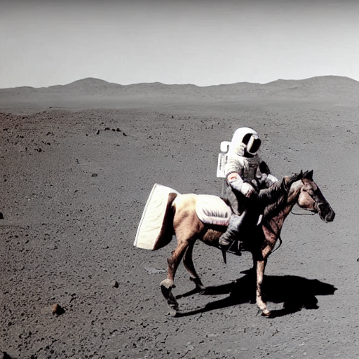

# Run Stable Diffusion with Alpa

### Usage

1. Install [alpa](https://alpa.ai/install.html)

2. Install diffusers from this repo:

    ```bash
    git clone https://github.com/A1trialist/diffusers.git
    cd diffusers
    pip install -e
    ```

3. Run scripts in `./alpa_scripts`

    (a) Text to image:
    ```bash
    python ./alpa_scripts/txt2img.py
    ```
    You should now be able to see the generated picture `t2i_output.png`:
    

    (b) Image to image:
    ```bash
    python ./alpa_scripts/img2img.py
    ```
    You should now be able to see the generated picture `i2i_output.png`:
    


4. To use a ray cluster, you may set `ray_enabled` in `./alpa_scripts/txt2img.py` / `./alpa_scripts/img2img.py` 

### Modification on diffusers

`pipeline_flax_stable_diffusion.py` and `pipeline_flax_stable_diffusion_img2img.py` in derectory `src/diffusers/pipelines/stable_diffusion/` are modified to make use of alpa

### Performance

**1 node 1 GPU**

Latency

```
Timer before main loop[ms] 243.576209
Timer main loop[ms] 3321.735906
	Timer do iter 0[ms] 820.569164
	Timer do iter i[ms] 51.044219224489794 (i in [1...49])
Timer after main loop[ms] 114.355661

E2E Latency[ms]: 3679.667776
```

**1 node 2 GPU**

Latency

```
Timer before main loop[ms] 506.676671
Timer main loop[ms] 4176.642739
  Timer do iter 0[ms] 1981.139556
  Timer do iter i[ms] 44.806187 (i in [1...49])
Timer after main loop[ms] 225.629302

E2E Latency[ms]: 4908.948712
```

- Per-iteration latencies of iter_{1...49} dropped
- However, the first iteration of each inference loop shows a much longer latency.
  - `alpa`ed `vae` and `text_encoder` also take longer than in the 1-GPU scenario

**Ray enabled**

Only on 1 node, 2 GPU:

```
Timer before main loop[ms] 1503.548291
Timer main loop[ms] 9105.311422
  Timer do iter 0[ms] 6341.005403
  Timer do iter i[ms] 56.41440855102042
Timer after main loop[ms] 10965.639644

E2E Latency[ms]: 21574.499357
```

- `vae` is not `alpa`ed for now:

    ```
    if ray_enabled:
    image = vae_not_alpaed(args)
    else:
    image = vae_alpaed(args)
    ```
    
    which incurs a lentency of ~8s.

- The first iteration of each inference loop shows a much longer latency (as mentioned above).

### Questions

1. The alpa-assisted-stable-diffusion is currently implemented by modifying the source codes of `diffusers`. Should I launch a pull request containing all modified source codes, or simply let users clone this repo and `git install -e .` after installing `alpa`?

2. When `alpa`ing `vae` with `ray` enabled (that is, taking the `ray_enabled==False` branch in `pipeline_flax_stable_diffusion.py` (line 302), I got this exception:
    ```
    Traceback (most recent call last):
      File "/data/wly/.vscode-server/extensions/ms-python.python-2022.20.2/pythonFiles/lib/python/debugpy/vendored/pydevd/pydevd_bundle/pydevd_resolver.py", line 189, in _get_py_dictionary
        attr = getattr(var, name)
        File "/data/wly/alpa/alpa/device_mesh.py", line 1661, in _value
            npy_value[self.indices[i]] = fetched_np_buffers[ct]
            
            ValueError: No cast function available.
    ```
    Is it wrong to use `jnp.array`s casted from `alpa.mesh.DistributedArray`s as input of `alpa` functions, or is it simply my bugs?

3. For there is no full support for loops in alpa now, I decorated `text_encoder` (before & after main loop), main loop, and `vae` (after main loop) respectively. The performance can be affected by false gathering-and-reshardings between `alpa`ed functions. Is there any furthur plans on adding loop optimizations like `jax.lax.fori_loop` to `alpa`?

